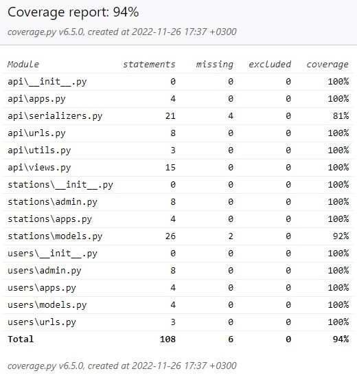

# Тестовое задание Space_stations API

### Описание
Сервис по управлению космическими станциями. В сервисе хранится информация 
станциях и их позиции в пространстве. Через сервис можно CRUD станций и 
изменять из позицию. У станции 3 координаты: x, y, z. При запуске станции ее 
координаты по умолчанию равны: 100, 100, 100. Станция исправно может двигаться 
только в диапазоне положительных координат. Если Станция вышла за эти 
координаты, мы считаем ее неисправной, даже если в будущем она вернулась 
обратно в разрешенную зону. Позиция станции меняется через Указание: ось и 
значение смещения. За одно Указание можно сместиться только в одну сторону на
неограниченное расстояние.
Например: 
- Указание #1: ось - x, смещение - 100. После получения этого указания станция
сдвинется по оси X на 100 вправо.

### Используемые технологии
- Django
- Django Rest Framework
- Docker
- Docker-compose
- Poetry
- PostgreSQL

### Подготовка
- Клонировать проект с помощью git clone или скачать ZIP-архив:  
``` git clone <название репозитория> ```
- Перейти в папку space_station и создать файл .env со следущим содержимым:
```
SECRET_KEY=<любой набор символов>
DB_NAME=postgres
POSTGRES_USER=postgres
POSTGRES_PASSWORD=<любой набор символов>
DB_HOST=db
DB_PORT=5432
BASE_NAME=SQLite
```
### Запуск проекта если Docker не установлен(будет использована БД - SQLite)
- Установите виртуальное окружение:  
``` python -m venv venv ```  
- Активируйте виртуальное окружение:     
``` source venv/Scripts/activate ``` 
- Установите Poetry:  
``` pip install poetry ``` 
- Установите зависимости:   
``` poetry install ```
- Создайте и примените миграции:   
``` python manage.py migrate ```
- Запуск сервера:   
``` python manage.py runserver ``` 


### Запуск проекта если установлен Docker(будет использована БД - PostgreSQL)
- Запустите docker-compose:   
``` docker-compose up ```
- Создайте и примените миграции:   
``` docker-compose exec web python manage.py migrate ```

### Запуск тестов:
``` pytest ```

#### Доступ в админку
- Создаете суперпользователя Django   
  - если установлен Docker  
  ``` docker-compose exec web python manage.py createsuperuser ```
  - если Docker не установлен  
  ``` python manage.py createsuperuser ```
- Перейдите по адресу:  
``` GET /admin/ ``` 

#### Примеры некоторых запросов API:
Регистрация пользователя:  
``` POST /auth/users/ ```  
Получение токена:    
``` POST /auth/token/login/ ```      
Получение данных своей учетной записи:    
``` GET /auth/users/me/ ```  
Создание станции:  
``` POST /api/stations/ ```  
Удаление станции:  
``` DELETE /api/stations/{id}/ ```  
Движение станции:  
``` POST /api/stations/{id}/state/ ```  

#### GET запросы на эндпониты:
- /api/stations/
- /api/stations/id/
- /api/stations/id/state/   
разрешены любым пользователям.         
#### POST, PUT, PUTCH, DELETE только авторизованным или суперпользователю.

##### После запуска сервера будет доступна документация к API по адресу [http://127.0.0.1:8000/api/schema/swagger/](http://127.0.0.1:8000/api/schema/swagger/).
##### Для авторизации в swagger введите - Token ваш_токен

#### Coverage


Время выполнения - 18 часов

#### Автор:
Стацюк Виталий - [https://github.com/VitaliySta](https://github.com/VitaliySta)
